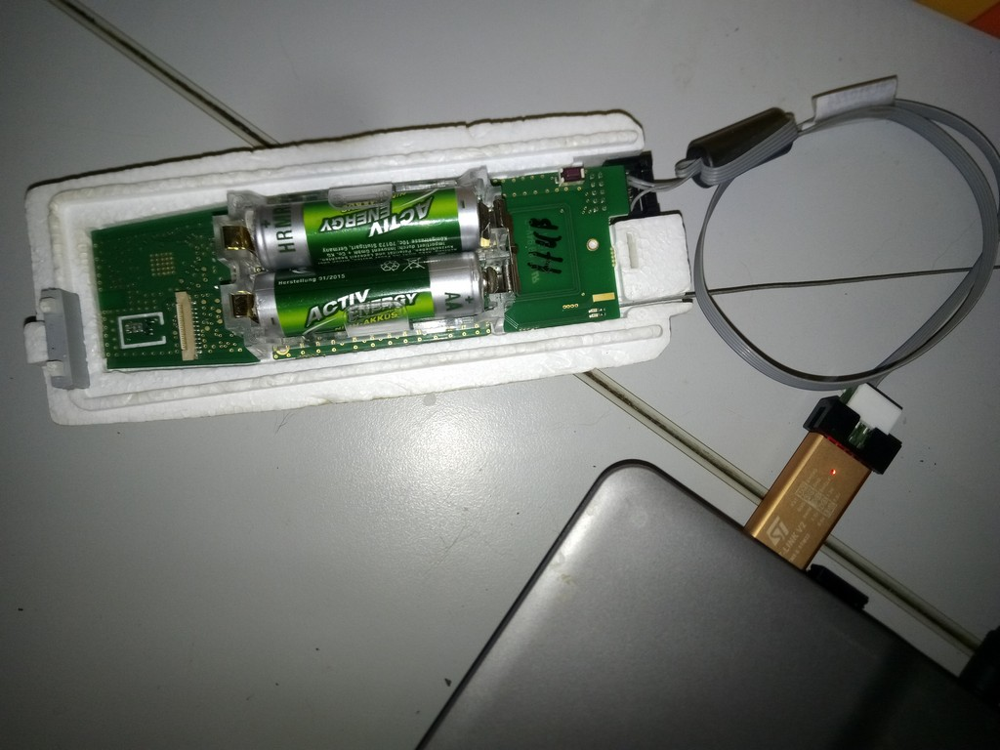

<!DOCTYPE html>
<html class="no-js" lang="en">
  <head>
    <meta http-equiv="content-type" content="text/html; charset=UTF-8">
    <meta charset="utf-8">
    <meta http-equiv="x-ua-compatible" content="ie=edge">
    <meta name="description" content="">
    <meta name="viewport" content="width=device-width, initial-scale=1">
    <link rel="canonical" href="http://html5-templates.com/">
    <link rel="apple-touch-icon" href="apple-touch-icon.png">
    <!-- Place favicon.ico in the root directory -->
    <link rel="stylesheet" href="style.css">
  </head>
  <body>
    <!--[if lt IE 8]>
            
You are using an <strong>outdated</strong> browser. Please <a href="https://browsehappy.com/">upgrade your browser</a> to improve your experience.

        <![endif]-->
    

      
 
        

          <h1>Vaisala RS-41 SGP
              Modification. </h1>
          

          

          
&nbsp;&nbsp;&nbsp;&nbsp;&nbsp; &nbsp;
          

           
          
Radiosondes are
            light weight sensor packages that are attached to weather
            balloons.  
            They transmit live RF weather telemetry down to earth as
            they rise.  
            One related hobby that a few people enjoy is radiosonde
            chasing, which is tracking and collecting radiosondes once
            they have fallen back to the earth.  
            Some people collect them as trophies, and others like to
            repurpose them.

          
Another way to
            repurpose radiosondes is to reprogram the commonly used
            Vaisala RS-41 radiosondes into being able to transmit radio
            APRS, 4FSK, RTTY or CW mode signals in the ISM or HAM bands.
             
            The initial modified firmware was first performed by SQ5RWU,
            and then OM3BC who managed to create firmware able to
            configure settings thru the serial connection off the
            radiosonde. 
            Darkside did also modified firmware and added a very
            promising demodulation mode 4FSK, which not only decrease
            the package size but also has better coverage.  
            This firmware could be useful for anybody requiring a cheap
            transmitter for their own high altitude balloon experiments. 
          

          
Also it is
            possible to enter the service menu of the Vaisala RS-41
            Radiosonde to learn more about its operation. 
          

           
          

            
Contents:

             
            <ul>
                  <li>1.1&nbsp; <a href="#Hardware_Details_">Hardware
                        Details</a> </li>
                  <li>1.2&nbsp; <a href="#Needed_Stuff_">Needed
                        stuff</a>&nbsp; </li>
                  <li>1.3&nbsp; <a href="#RS-41_Connector_">RS-41
                        Connector</a> 
                    </li>
                  <li>1.4&nbsp; <a
                      href="#ST-Link_STM32_Connection_">ST-LINK STM32
                      Connection</a></li>
                  <li>1.5&nbsp; <a
                      href="#Orginal_Firmware_and_Terminal_Connection">Orginal
                      Firmware and Service Menu </a> 
                  </li>
                  <li>1.6&nbsp; <a href="#Firmware_">Modified
                      Firmware</a> </li>
                  <li>1.7&nbsp; <a href="#Program_and_Flashing_">Program
                        and Flashing</a></li>
                  <li>1.8&nbsp; <a href="#Horus-Decoder_">Horus-Decoder</a> 
                    </li>
                  <li>1.9&nbsp; <a href="#OM3BC_Firmware_">OM3BC
                      Firmware</a><a href="#Zilog_DFM_Decoder_Scripts_"> 
                    </a></li>
                </ul>
              </li>
            </ul>
          

          <h2>Hardware Details 
          </h2>
           
          The radiosonde RS41-SG was introduced by Vaisala in 2013.  
          On <a
href="https://www.vaisala.com/en/products/instruments-sensors-and-other-measurement-devices/soundings-products/rs41"
            target="_blank">Vaisala's website</a> it is possible to find
          very detailed specifications of the RS41-SG. 
           
          
LED Lights operation.

          
Red LED: 
            1 - Temperature or humidity sensor broken. 
            2 - Low battery. 
            3 - Battery should be empty. 
            4 - Expected interface, but there is none. 
             
            Flashing Green LED: 
          

          
Insufficient data for GPS
            positions. 
             
            After switching on the RS41, the LED will flashes four
            times.

          
Flashing Green LED: 
            1 - Turns red when something is wrong. 
            2 - Enable transmitter. 
             
            When the Radiosonde is flying over 100 seconds,

          
1 - The LED goes out. 
            2 - And the transmitter operates at full power.

           
          PE2BZ - The point inside the red "rectangle" represents a source of power connection from 1 single 1.5 V battery, outside the switch.
          Operation goes up to 0.85 volts.

           
           
           
          <a href="https://github.com/bazjo/RS41_Hardware"
            target="_blank">RS-41 Details Thanks to Bazjo</a> 
          <h2>Needed Stuff 
          </h2>
           
          USB-TTL converter. 
          Some wires and connectors. 
          Soldering tools. 
          ST-LINK STM32. 
          &nbsp; 
          <h2>RS-41 Connector 
          </h2>
           
           
           
          
1 - GND

          
2 - Uart3 Rx

          
3 - Uart3 Tx

          
4 - PB1 * (10k + cap + 10k)

          
5 - Vcc (Boost out) 5.0V

          
6&nbsp; VBAT 3.3V

          
7 - RST

          
8 - SWCLK

          
9 - SWDIO = SWID

          
10- GND

           
          <h2>ST-Link STM32
            Connection 
          </h2>
          
  
            Download ST-LINK STM32 Software <a
              href="http://www.st.com/en/development-tools/stsw-link004.html"
              target="_blank">http://www.st.com/en/development-tools/stsw-link004.html</a> 
          

          
 
          

           
          Connect ST-LINK STM32: 
           
          
RS41 ----- ST-LINK

          
===================

          
Pin 1 ----- GND

          
Pin 8 ----- SWCLK

          
Pin 9 ----- SWDIO = SWID 
             
          

          
 
             
          

           
           
          <h2>Orginal
            Firmware and Service Menu </h2>
          
 
          

          For a terminal connection the following data pins are
          connected to the USB TTL Serial Converter in order to enter
          the service menu: 
           
           
           
          
Pin 1 ----- GND

          
Pin 2 ----- TxD

          
Pin 3 ----- RxD 
          

          
 Pin 4 ----- 3.3V 
            Or: 
          

          Pin 5 ----- 3.3V 
           
           
          
Build together -&gt; 
          

           
           
          Connect a terminal (9k6 8N1) to the XDATA UART port.  
          
Select COM Port (most probaly <a
href="http://www.prolific.com.tw/US/ShowProduct.aspx?p_id=225&amp;pcid=41"
              target="_blank">Prolific driver</a> is needed on Windows)
            .

          
Start (hyper)terminal like Putty
            and connect to serial COM Port and use 9600 Baud.

           
          
Power on RS-41, Welcome message should appear with
            information about software version, serial number, etc: 

          
Vaisala RS41 Radiosonde SW
            V2.02.14&nbsp;&nbsp;&nbsp;&nbsp;&nbsp;&nbsp;&nbsp;&nbsp;&nbsp;&nbsp;&nbsp;&nbsp;&nbsp;&nbsp;&nbsp;&nbsp;&nbsp;&nbsp;&nbsp;&nbsp;&nbsp;&nbsp;&nbsp;&nbsp;&nbsp;&nbsp;&nbsp;&nbsp;&nbsp;&nbsp;&nbsp;&nbsp;&nbsp;&nbsp;&nbsp;&nbsp;&nbsp;&nbsp;&nbsp;&nbsp;
             
            Copyright (c) Vaisala Oyj 2016. All rights
            reserved.&nbsp;&nbsp;&nbsp;&nbsp;&nbsp;&nbsp;&nbsp;&nbsp;&nbsp;&nbsp;&nbsp;&nbsp;&nbsp;&nbsp;&nbsp;&nbsp;&nbsp;&nbsp;&nbsp;&nbsp;&nbsp;&nbsp;&nbsp;&nbsp;&nbsp;&nbsp;
             
            Serial number: P1234567
            &nbsp;&nbsp;&nbsp;&nbsp;&nbsp;&nbsp;&nbsp;&nbsp;&nbsp;&nbsp;&nbsp;&nbsp;&nbsp;&nbsp;&nbsp;&nbsp;&nbsp;&nbsp;&nbsp;&nbsp;&nbsp;&nbsp;&nbsp;&nbsp;&nbsp;&nbsp;&nbsp;&nbsp;&nbsp;&nbsp;&nbsp;&nbsp;&nbsp;&nbsp;&nbsp;&nbsp;&nbsp;&nbsp;&nbsp;&nbsp;&nbsp;&nbsp;&nbsp;&nbsp;&nbsp;&nbsp;&nbsp;&nbsp;&nbsp;&nbsp;&nbsp;&nbsp;
             
            Pressure module serial number: Px SW
            V2.01&nbsp;&nbsp;&nbsp;&nbsp;&nbsp;&nbsp;&nbsp;&nbsp;&nbsp;&nbsp;&nbsp;&nbsp;&nbsp;&nbsp;&nbsp;&nbsp;&nbsp;&nbsp;&nbsp;&nbsp;&nbsp;&nbsp;&nbsp;&nbsp;&nbsp;&nbsp;&nbsp;&nbsp;&nbsp;&nbsp;
             
            Transmitter frequency: 403.90
            MHz&nbsp;&nbsp;&nbsp;&nbsp;&nbsp;&nbsp;&nbsp;&nbsp;&nbsp;&nbsp;&nbsp;&nbsp;&nbsp;&nbsp;&nbsp;&nbsp;&nbsp;&nbsp;&nbsp;&nbsp;&nbsp;&nbsp;&nbsp;&nbsp;&nbsp;&nbsp;&nbsp;&nbsp;&nbsp;&nbsp;&nbsp;&nbsp;&nbsp;&nbsp;&nbsp;&nbsp;&nbsp;&nbsp;&nbsp;&nbsp;&nbsp;&nbsp;&nbsp;&nbsp;
             
            Transmitter power:
            3/7&nbsp;&nbsp;&nbsp;&nbsp;&nbsp;&nbsp;&nbsp;&nbsp;&nbsp;&nbsp;&nbsp;&nbsp;&nbsp;&nbsp;&nbsp;&nbsp;&nbsp;&nbsp;&nbsp;&nbsp;&nbsp;&nbsp;&nbsp;&nbsp;&nbsp;&nbsp;&nbsp;&nbsp;&nbsp;&nbsp;&nbsp;&nbsp;&nbsp;&nbsp;&nbsp;&nbsp;&nbsp;&nbsp;&nbsp;&nbsp;&nbsp;&nbsp;&nbsp;&nbsp;&nbsp;&nbsp;&nbsp;&nbsp;&nbsp;&nbsp;&nbsp;&nbsp;&nbsp;&nbsp;
             
            Enabled TX&nbsp;  
          

           
          Now enter the following five characters and press Enter : 
          
STwsv 
             
            Press ENTER again and you should see a service menu. 
            Where you can change the TX power, frequency and more
            options.

           
          (S)ensors&nbsp;&nbsp;&nbsp;&nbsp;&nbsp;&nbsp;&nbsp;&nbsp;
          Fre(q)uencies&nbsp; (P)arameters&nbsp;&nbsp;&nbsp;
          (A)lfa&nbsp;&nbsp;&nbsp;&nbsp;&nbsp;&nbsp;&nbsp;&nbsp;&nbsp;&nbsp;
          TX p(o)wer 
          TX (f)requency&nbsp;&nbsp;&nbsp; T(X)
          state&nbsp;&nbsp;&nbsp;&nbsp; (T)X registers&nbsp; TX
          contin(u)ous&nbsp; TX ran(d)om 
          TX (c)arrier&nbsp;&nbsp;&nbsp;&nbsp;&nbsp; (B)aud
          rate&nbsp;&nbsp;&nbsp; Ser(i)al no&nbsp;&nbsp;&nbsp;&nbsp;
          (R)ed LED info&nbsp;&nbsp; (N)o menu 
          (K)eep test mode&nbsp; S(W) version&nbsp;&nbsp;
          (M)easurements&nbsp; (L)aunch/Drop&nbsp;&nbsp;&nbsp; (E)xit 
          &gt;Enabled TX 
          &nbsp; 
          A few examples: 
           
          X Transmission of the data is stopped. 
          o Change power level 0 - 7. 
          f&nbsp; Change Frequency. 
          i&nbsp; Change Serial Number 
          K Keep test mode, with this setting you do not have to re
          enter the pw again in order to show the service menu. 
          M Measurements show the following menu: 
           
          (S)ensors&nbsp;&nbsp;&nbsp;&nbsp; Fre(q)uencies&nbsp; S(W)
          reset&nbsp;&nbsp;&nbsp;&nbsp;&nbsp;&nbsp; (D)efault
          params&nbsp; (U)se sensor 
          (R)eg offset&nbsp; Reg (c)heck&nbsp;&nbsp;&nbsp; (T)
          self-check&nbsp;&nbsp; St(o)p sequence&nbsp;&nbsp; (H)eat ref 
          (G)PS&nbsp;&nbsp;&nbsp;&nbsp;&nbsp;&nbsp;&nbsp;&nbsp;
          (N)MEA&nbsp;&nbsp;&nbsp;&nbsp;&nbsp;&nbsp;&nbsp;&nbsp;
          D(I)rect GPS mode (E)xit 
          &nbsp; 
          D Direct GPS mode, with option the RS-41 can be used as a GPS
          mouse sending True NMEA bidirectional data via UART, you can
          also send "N" then just NMEA is output. 
           
          Unfortunately, the settings are not retained after a power
          cycle. 
           
          The (T)X Registers menu option allows reading and writing of
          arbitrary register values.  
          However, these changes are not persistent, and get overwritten
          on startup, and whenever the transmitter is disabled and
          re-enabled. 
          The (T)X register menu is used by entering: 
          Txx\r&nbsp;&nbsp; (where xx is the register value in hex) 
          You get a prompt as follows: 
          &nbsp;&gt;T 
          Register number (00-7F) &gt;77 
          Register value E3 &gt; 
          At this point you can either send a \r to exit back to the
          main menu, or you can enter a value in hex + \r which will be
          written to that register. 
          Example RS41 onto the 70cm band (434.650 MHz) by programming
          the following values: 
           
          0x75: 61 
          0x76: 10 
          0x77: D3 
           
          A very handy online Calculator for more Frequencies is <a
href="https://www.makemehack.com/2020/12/how-to-change-the-tx-frequency-of-the-vaisala-rs41-radiosonde.html"
            target="_blank">overhere</a>. 
           
          P (parameters): 
           
          Data ID is a hexadecimal number. 
          The value does not seem to have any meaning other than being
          used as a selector. 
          Values ​​are strings or decimal numbers. 
           
          ID card Value Changeable Note:
          
10 5 * 
            20 14 * 
            30 0 * 
            40 0 * 
            45 S0341201 * Serial number 
            50 RS41-SG * RS41 model 
            60 20215 --- Firmware Version (V2.02.15) 
            70 9089 * 
            80 4 --- 
            90 5 --- 
            A0 
            B0 
            C0 
            D0 600 * Height [m] above the launch site that the RS41 must
            climb to before entering flight mode. 
            E0 18 * Low battery voltage threshold [100 mV] below which
            the probe will turn off (if the condition persists for some
            time). 18 = 1.8V 
            100180 
            110 60 
            120 1700 
            130 20 
            140135 
            150 50 
            160 1 
            170 RSM412 PCB type 
            180 R4550425 PCB serial 
            190 0000000000 
            1A0 
            1A8 
            1B0 
            1B8 
            1C0 
            1C8 
            1D0 
            1D5 
            1D8 
            1E0 
            200 29 --- Current battery voltage [100 mV]. 29 = 2.9 V. 
            210 0 --- 
            220 41 --- Current CPU temperature [° C] 
            230 48 --- Current radio temperature (Si4032) [° C] 
            240 1 --- 
            250 42 --- Current temperature reference range [° C] 
            255 
            260

          <h2>Modified Firmware 
          </h2>
          
 
            There are a few different firmware's each with their
            advantages. 
          

           
          1: 70cm Band, GPS and telemetry data in RTTY, APRS and CW on
          seperately defineable TX frequencies. 
          <a href="https://github.com/df8oe/RS41HUP" target="_blank">https://github.com/df8oe/RS41HUP</a> 
           
          
2: 70cm Band, GPS and telemetry
            data in CW, RS41-FOX - RS41 Amateur Radio Direction Finding
            (Foxhunting) Beacon 
            This codebase turns a Vaisala RS41 into a 70cm 'radio fox',
            suitable for use in amateur radio direction finding
            contests.  
            <a href="https://github.com/darksidelemm/RS41FOX"
              target="_blank">https://github.com/darksidelemm/RS41FOX</a> 
          

          
Features:

          
 Morse Ident containing callsign
            &amp; current battery voltage. 
            Long CW beacon (user-defined length and number of repeats) 
            Low-Voltage Cutout, to avoid destroying rechargable
            batteries. 
            Beacon GPS position when battery is below a user-defined
            threshold. 
             
          

          
3: 70cm Band, GPS and telemetry
            data in 4FSK and RTTY. 
            <a href="https://www.rowetel.com/?p=5906" target="_blank">Information
              on the 4FSK mode's performance.</a> 
          

          
Recommend for short and long HAB
            floater flights. 
          

           
          
 Features:

          
Powersave modes for Radio: 
            Then the transmitter will turn off between transmissions,
            saves about 50mA of power consumption. 
          

          
GPS in PowerSave Mode,
            Transmitting @ 13 dBm = ~120 mA, not Transmitting = 30-50mA,
            depending on GPS state. 
          

          
Deep Sleep Mode intended for
            long duration flights only! 
            Power consumption in sleep mode = 32mA @ 3V 
             
            In this mode, the GPS is turned into a sleep mode in between
            transmissions. 
            During this sleep period, we sent one 'pip' every few
            seconds. 
            At the end of the sleep period, the GPS is powered back up,
            and we await the GPS to obtain a fix before transmitting our
            position.  
            While waiting for GPS lock, we send a 'double pip'.

          
Tracking sonde position from
            habhub. 
             
            <a href="https://github.com/darksidelemm/RS41HUP"
              target="_blank">https://github.com/darksidelemm/RS41HUP</a>

          
 
          

          
Settings and Config (edit in
            config.h) for this software must be written before flashing. 
             
          

          
Grab the latest GNU ARM Embedded toolchain from here: <a
href="https://developer.arm.com/open-source/gnu-toolchain/gnu-rm/downloads"
              target="_blank">https://developer.arm.com/open-source/gnu-toolchain/gnu-rm/downloads</a> 
            Extract the tarball to ~/opt/

          
Within the RS41HUP directory: 
            Edit CMakeLists.txt and set the correct path to the un-tar'd
            directory. 
            cmake . 
            make 
             
          

           
          
 
          

          
<b>Note:</b> 
          

          
For your own flights, you will need to request a payload
            ID.

          
Payload IDs can be requested by either raising an Issue, or
            a Pull Request on
            https://github.com/projecthorus/horusdemodlib/

          Change the payload ID in config.h 
          #define BINARY_PAYLOAD_ID 0 // Payload ID for use in Binary
          packets  
           
          Use the newly created bin or hex file to flash the RS-41. 
           
          <h2>Program and
            Flashing&nbsp;&nbsp;&nbsp;&nbsp;&nbsp;&nbsp;&nbsp;&nbsp;&nbsp;&nbsp;&nbsp;&nbsp;&nbsp;&nbsp;&nbsp;&nbsp;&nbsp;&nbsp;&nbsp;&nbsp;&nbsp;&nbsp;&nbsp;&nbsp;&nbsp;&nbsp;&nbsp;&nbsp;&nbsp;&nbsp;&nbsp;&nbsp;&nbsp;&nbsp;&nbsp;&nbsp;&nbsp;&nbsp;&nbsp;&nbsp;&nbsp;&nbsp;&nbsp;&nbsp;&nbsp;&nbsp;&nbsp;&nbsp;&nbsp;&nbsp;&nbsp;&nbsp;&nbsp;&nbsp;
             
          </h2>
           
           
           
          Connect RS-41 and power on. 
           
          Open ST-Link Utility: 
          
 
          

           
           
          
Load bin or hex file. 
             
          

          
          
 
          

          
In target menu select Connect. 
             
          

          
          
 
          

          
 

          
This message can happen:

          
Can not read memory!

          
Read out protection is activated

          
Disable Read Out Protection and retry.

          
In the target menu/option bytes/ disable bytes read out
            protection. 
             
          

           
           
          Target menu select Program and wait for flash to finish and
          disconnect. 
          Disconnect RS-41 and ST-LINK STM32. 
           
          <h2>Horus-Decoder 
          </h2>
           
          Telemetry demodulator for the following modems in use by
          Project Horus and <a
            href="https://github.com/darksidelemm/RS41HUP"
            target="_blank">RS-41 4FSK Modified Firmware</a> 
           
          Horus Binary Modes (4FSK) 
          v1 - Legacy 22 byte mode, Golay(23,12) FEC 
          v2 - 16/32-byte modes, LDPC FEC (Under development) 
          RTTY (7N1, 7N2 and 8N2, standard UKHAS sentences with CRC16
          only) 
           
          <a href="https://rfhead.net/horus/horusgui/" target="_blank">Windows
            builds overhere</a> 
          <a href="https://github.com/projecthorus/horusbinary"
            target="_parent">Linux decoder for the 4FSK mode is
            available overhere</a> 
           
           
           
          Flash RS-41 with <a
            href="https://github.com/darksidelemm/RS41HUP"
            target="_blank">4FSK Modified Firmware</a> 
          Tune in with any SDR Application (<a
            href="https://github.com/projecthorus/horusdemodlib"
            target="_parent">or the Horus rtl_fm scripts</a>) on the
          frequency specified in config.h in USB Mode. 
           
          Start Horus-gui decoder: 
           
           
           
          Select audio device (in this example YDP thru GQRX is used). 
          Mode RTTY of 4FSK, check mark for data feed to <a
            href="https://tracker.habhub.org/" target="_blank">habhub
            upload.</a> 
           
          Output is also possible with UDP thru <a
            href="https://github.com/projecthorus/chasemapper/"
            target="_blank">Chasemapper.</a> 
          
 

          <h2>OM3BC Firmware 
          </h2>
           
          70cm Band, GPS and telemetry data in RTTY, APRS and CW on
          seperately defineable TX frequencies, 
          configurable settings thru terminal serial connection from the
          radiosonde.  
          <a href="http://www.om3bc.com/docs/rs41/rtty.hex"
            target="_blank">Hex file for flashing from om3bc.com</a> 
          Recommend for playing with the Radiosonde but not for real
          flight's GPS outage occur for shorts periods during flight. 
          APRS callsign bugs. 
           
          
Start (hyper)terminal like Putty
            and connect to serial COM Port and use 9600 Baud.

          Power on RS-41, Welcome message should appear: 
           
          
          
$$$$$$ STM32 RTTY
                          &amp; APRS tracker by OM3BC ... 
                          cmd&gt; 
                           
                        Allowed commands
                          (not case sensitive): 
                           
                          BUTTON ON / OFF - use button to turn off /
                          this parameter specifies whether the push
                          button can be used to turn off the radiosonde
                          or not. 
                          LEDs on / off - use LEDs / you can save energy
                          when you do not use LEDs. After switching on,
                          the LEDs always work, but when set to OFF,
                          they automatically turn off after 10 minutes
                          of operation. 
                          POWER n - rf power n = 1 to 7 (7 is max.) /
                          output power setting 0 = smallest, 7 = maximum
                          power (approx. 40 mW). 
                          APRSFRQ n - n = aprs frequency in kHz / APRS
                          frequency (recommended frequency is 432,500
                          MHz) 
                          RTTYFRQ n - n = rtty frequency in kHz / RTTY
                          frequency. This frequency is also valid for CW
                          identification. 
                          APRSCALL string - aprs callsign (up to 6
                          characters) 
                          RTTYCALL string - rtty callsign (up to 15
                          characters) 
                          CWIDMESS string - cw message (up to 25
                          characters) 
                          RTTY on / off - send rtty message 
                          HOLDOFF n - n = time between two rtty messages
                          in seconds 
                          BAUD n - n = rtty baudrate 
                          DBITS n - n = rtty databits (7 or 8) 
                          SBITS n - n = rtty stop bits (1 or 2) 
                          SHIFT n - n = 1,2,3,4 1 = 270, 2 = 540, 3 =
                          810, 4 = 1080 Hz 
                          TEMP on / off - send temperature in rtty
                          messages / (The value is the temperature of
                          the radio chip, not the environment.) 
                          ALT on / off - send altitude in rtty &amp;
                          aprs messages 
                          SPEED on / off - send speed in rtty messages 
                          COURSE ON / OFF - send course in rtty messages 
                          UBAT on / off - send battery voltage in rtty
                          messages 
                          USYS on / off - send system voltage in rtty
                          messages / This is a constant value for
                          testing only. 
                          SAT on / off - the number of GPS satellites
                          heard in rtty messages 
                          APRS on / off - send aprs messages 
                          SPEEDCOURSE on / off - send speed and course
                          in aprs messages 
                          SYMBOL string - symbol from aprs symbol table
                          (2 characters) / two characters that determine
                          how the radiosonde appears on the www.aprs.fi
                          website.  
                          SSID n - aprs ssid n = 1 to 15 / the caller ID of
                          the APRS.  
                          TXD n - Tx delay n = 10 to 500 
                          MICE on/off - send coded aprs messages in
                          mic-e format 
                          TELEMETRY on/off - send telemetry data in aprs
                          messages 
                          APRS_EVERY n - time between aprs messages is n
                          x holdoff / APRS packages are not required to
                          be given too often. This parameter specifies
                          the time between the two packets. 
                          TAIL_EVERY n - time between tail text is n x
                          aprs time / frequency of transmission of the
                          attached information text (comment field). 
                          TTEXT string - tail text (up to 100
                          characters) / attached information text
                          (comment). 
                          CWID on/off - send cwid messages 
                          CWID_EVERY n - time between cw messages is n x
                          holdoff 
                          CW_SPEED n n = the CW identification speed in
                          WPM. 
                          IGATE on/off - monitoring aprs message via
                          UART / after the parameter has been enabled,
                          the radiosonde sends a text through the serial
                          port that the iGate can link to. 
                          NMEA on/off - send MNEA GPGGA and GPRMC
                          messages via UART / If the parameter has been
                          enabled, the radiosonde sends standard NMEA
                          GPGGA and GPRMC text via the serial port. 
                          DISP - shows the set parameters. 
                          SERCOM n - speed of serial communication port
                          (n =&nbsp;300 to 115200) 
                          DEF - set parameters to default values. 
                          SAVE - save parameters to flash 
                           
                          If you need help, you can use the HELP or the
                          ? command.  
             
          

           
           
          RS-41 Sending APRS Decode with Soundmodem. 
           
           
           
          RS-41 Sending RTTY Decode with FLdigi. 
           
           
           
          APRS Position showing in APRSIS32. 
           
          
          
Connect it with Solar panels
            like PE2BZ did and launch it :)

          
  
          

          
Note:

          
<a href="https://airspy.com/download/" target="_blank">SDRSharp</a>

          
<a href="http://gqrx.dk/" target="_blank">Gqrx</a>

          
<a href="http://uz7.ho.ua/packetradio.htm" target="_blank">UZ7HO
              SoundModem</a>

          
<a
href="https://drive.google.com/open?id=160_7nVCYmewZSPXMG9on-2Gah_uHO5KP"
              target="_blank">FLdigi Appimage</a>

          
<a
              href="https://sourceforge.net/projects/fldigi/files/fldigi/"
              target="_blank">FLdigi Windows</a>

          
ST-LINK STM32 / USB-TTL Converter can be found on Ali/Ebay.

        

    

  </body>
</html>
